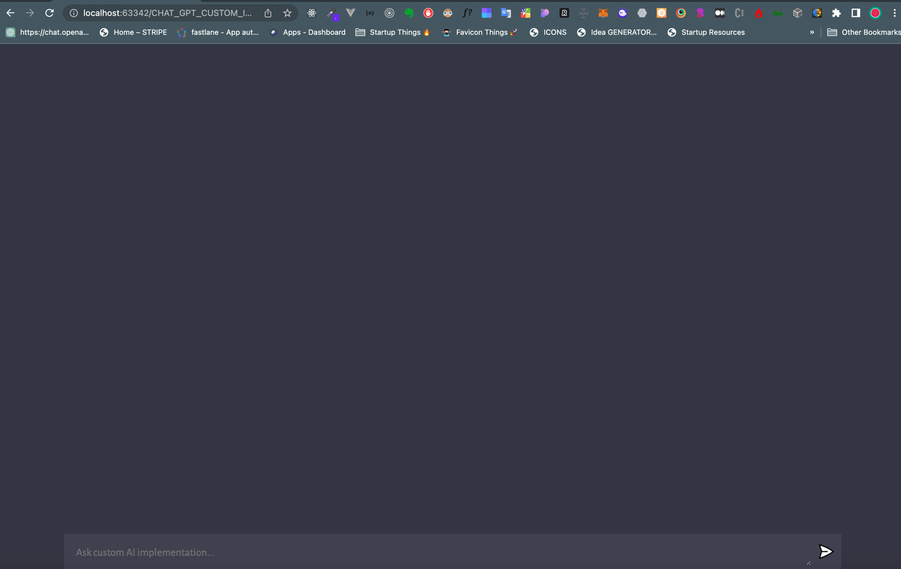

### Open AI custom implementation of the GPT-3 model

This is a custom implementation of the GPT-3 model, based on the paper [Language Models are Unsupervised Multitask Learners](https://cdn.openai.com/better-language-models/language_models_are_unsupervised_multitask_learners.pdf) by Alec Radford, Jeffrey Wu, Rewon Child, David Luan, Dario Amodei, and Ilya Sutskever.

You can try it out live or use this project as reference for your own implementation. It is written in Javascript and uses Open AI's models.

## Live demo

FrontEnd:

https://rookas-open-ai-explain.web.app

Backend:

https://rookas-open-ai-custom-implementation.onrender.com
